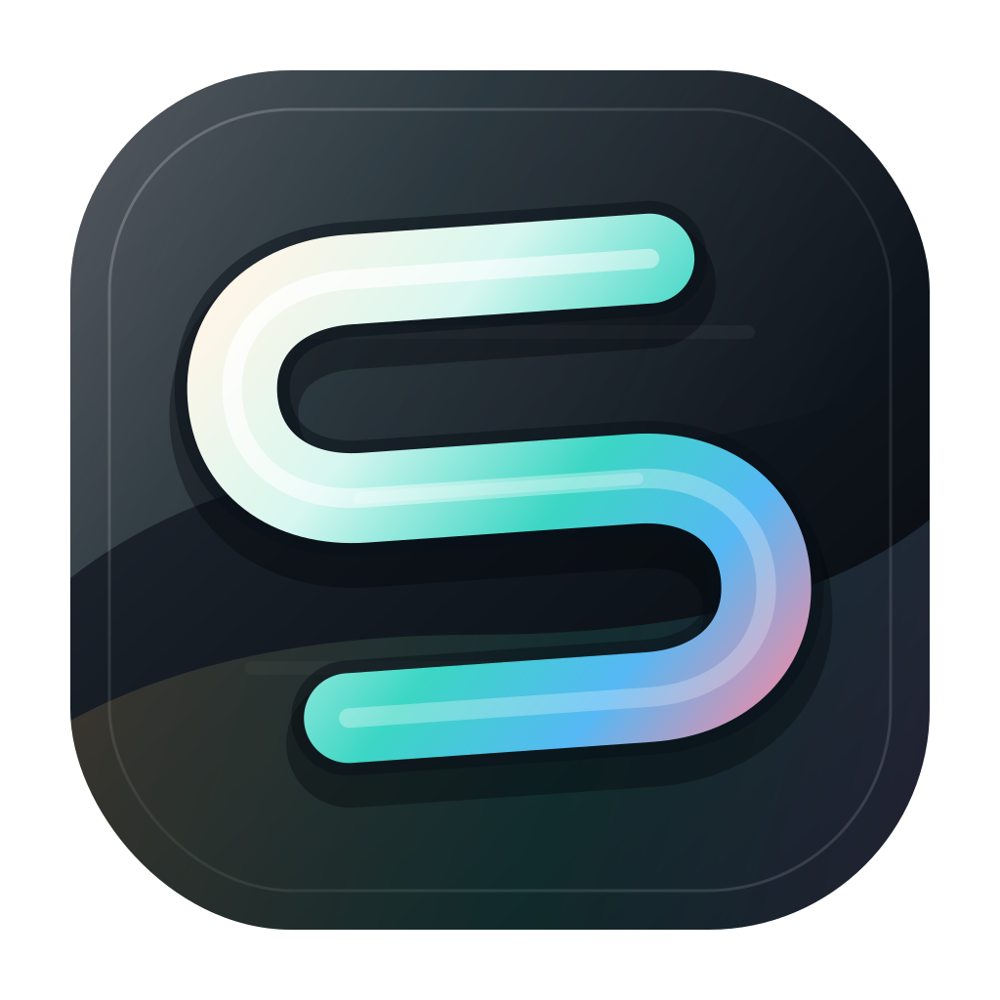
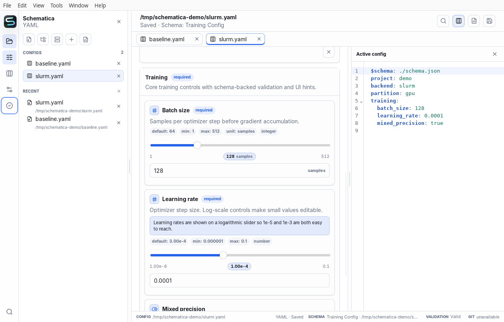
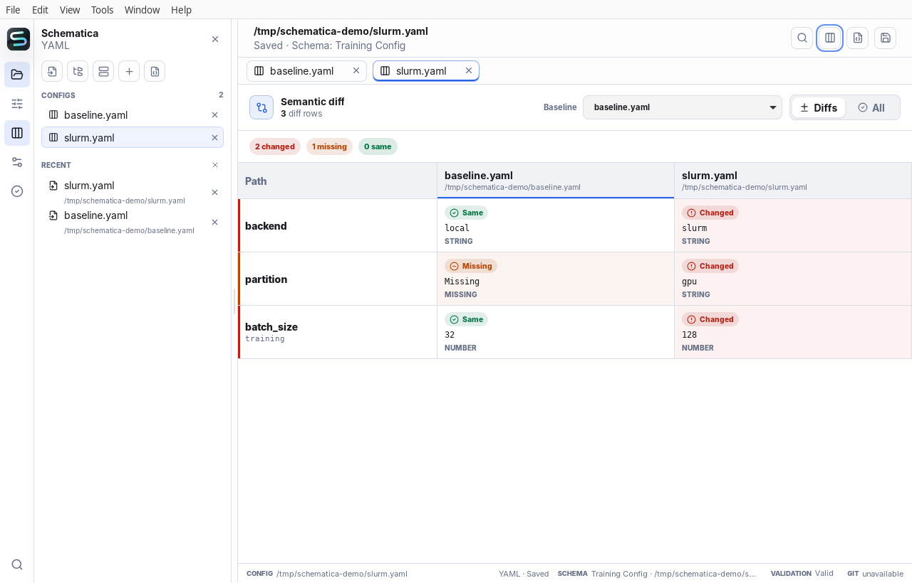
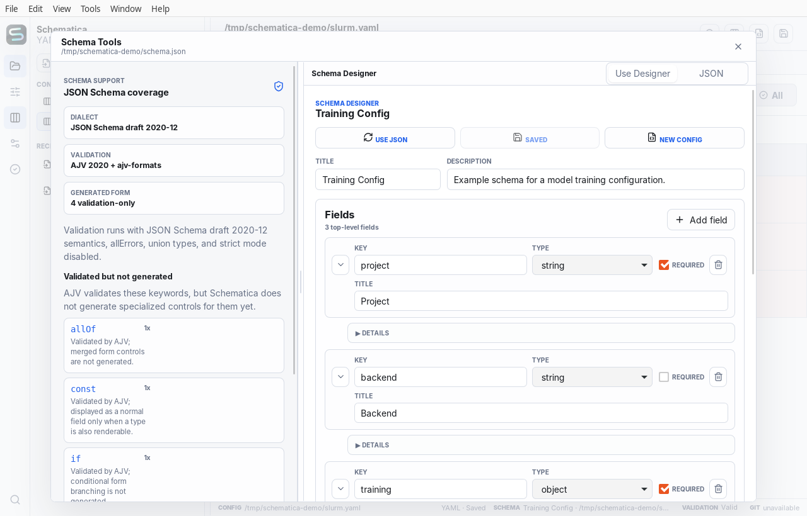

<p align="center">
  
</p>

<h1 align="center">Schematica</h1>

<p align="center">
  <strong>A schema-driven desktop editor and CLI for YAML, JSON, and TOML configuration.</strong>
</p>

<p align="center">
  <a href="https://nkiyohara.github.io/schematica/">Website</a>
  ·
  <a href="https://github.com/nkiyohara/schematica/releases">Releases</a>
  ·
  <a href="CONTRIBUTING.md">Contributing</a>
</p>

<p align="center">
  <a href="https://github.com/nkiyohara/schematica/actions/workflows/ci.yml">
    
  </a>
  
  
  
  
</p>

Schematica treats JSON Schema as the contract for real config files. It gives
humans a compact workbench for editing and comparing configs, while keeping the
same validation, parsing, defaults, and diff behavior available to scripts and
CI through a shared TypeScript core.

<p align="center">
  <a href="https://nkiyohara.github.io/schematica/">
    
  </a>
</p>

Schematica is designed for research, experiments, infrastructure, and other
configuration-heavy work where one wrong value can waste time or compute. A
schema turns constraints into usable controls; semantic comparison makes the
meaningful differences between run profiles explicit.

## Status

Schematica is preparing its first public beta. The core engine,
CLI, Tauri desktop app, comparison model, SSH resource layer, settings UI, and
release signing policy are wired end-to-end. The remaining release work is
distribution rather than a prototype rewrite: signed artifacts, public release
notes, and package-manager publication.

The repository root intentionally remains `"private": true` in `package.json`.
That only prevents accidental npm publishes from the monorepo root; it does not
affect GitHub visibility, source availability, GitHub Releases, or the MIT
license.

## Release Policy

| Target           | First-beta policy       | Notes                                                                             |
| ---------------- | ----------------------- | --------------------------------------------------------------------------------- |
| macOS            | Signed beta artifacts   | Apple silicon DMG, Developer ID signed and Apple-notarized, from GitHub Releases. |
| Linux            | Signed beta artifacts   | x86-64 AppImage/deb/rpm artifacts with GPG signatures and signed checksums.       |
| Windows          | Source build only       | Official Windows binaries are deferred until code signing is ready.               |
| CLI              | GPG-signed beta tarball | GitHub Release tarball with a detached `.asc` signature.                          |
| Package managers | Templates prepared      | Homebrew, APT/RPM, WinGet, AppStream, and updater templates live in `packaging/`. |

Windows is still smoke-built in CI so regressions are visible, but unsigned
installers are not uploaded to GitHub Releases and should not be submitted to
WinGet.

## Highlights

- Desktop workbench with Explorer, editor, compare, settings, problems, and
  status bar surfaces.
- YAML, JSON, and TOML parsing through the shared `@schematica/core` package.
- JSON Schema validation, generated defaults, path access, semantic diff rows,
  and machine-readable CLI output.
- Local and SSH config opening, including remote directory browsing from
  discovered SSH hosts and in-app password authentication when a key or agent
  is not available.
- Multi-config comparison for humans, CI, and AI agents.
- Schema-aware project configuration through `schematica.config.yaml`, JSON, or
  TOML.
- Appearance profiles, import/export/reset, and config-backed theme
  customization.
- Signed release policy for macOS and Linux, with secrets kept out of the
  repository.
- Complete UI catalogs for English, Japanese, Spanish, Simplified Chinese,
  Korean, French, and German, plus system-language detection.

## Product Tour

### Edit with schema-backed controls

Ranges, enums, required fields, units, defaults, descriptions, and validation
become visible controls. The source stays available beside the generated form,
and the split can be resized or stacked when space is tight.

### Compare experiment and deployment profiles

Schematica compares parsed values by path rather than treating configuration as
unstructured lines. Whitespace and key order stop hiding the change that can
alter a result.

<p align="center">
  
</p>

### Start with or without a schema

Open an existing JSON Schema, inspect feature coverage, or use the visual schema
designer. When no schema exists, Schematica can infer a practical form for
ordinary documents while keeping the raw editor available.

<p align="center">
  
</p>

## Quick Start

Requirements:

- Node.js 24+
- Corepack
- Rust 1.96+

```bash
corepack pnpm install
corepack pnpm check
corepack pnpm dev
```

Build the desktop app:

```bash
corepack pnpm desktop:build
```

On Linux, install the freshly built AppImage for the current user, including
the desktop launcher, MIME associations, and application icons:

```bash
corepack pnpm desktop:install-local
```

Linux desktop builds also need the standard Tauri WebKit/GTK dependencies:

```bash
sudo apt update
sudo apt install \
  libwebkit2gtk-4.1-dev \
  libssl-dev \
  libgtk-3-dev \
  libayatana-appindicator3-dev \
  librsvg2-dev \
  pkg-config
```

## CLI

```bash
corepack pnpm --filter @schematica/cli build
corepack pnpm schematica validate examples/config.yaml --schema examples/schema.json
corepack pnpm schematica defaults --schema examples/schema.json --format yaml
corepack pnpm schematica get examples/config.yaml training.batch_size
corepack pnpm schematica set examples/config.yaml training.batch_size 128
corepack pnpm schematica diff examples/config.yaml examples/config.slurm.yaml --json
```

The CLI test suite runs real `node packages/cli/dist/index.cjs ...` commands
against example configs, including schema validation, dry-run mutation, invalid
edit rejection, project config loading, and machine-readable multi-config diff
output.

## Architecture

```text
packages/core   JSON Schema validation, defaults, path access, YAML/JSON/TOML IO
packages/cli    Thin command-line frontend over the shared core
apps/desktop    Svelte + Tauri desktop app using the same core package
assets/brand    Public brand assets, including the app icon
packaging       Package-manager, updater, and metadata templates
```

Schematica keeps UI hints in an optional `x-ui` layer, so schemas remain
portable. The desktop form currently understands hints for ordering,
placeholders, read-only fields, units, color inputs, and log-scale numeric
sliders.

## Project Config

Schematica manages project-level behavior with `schematica.config.yaml`, or the
equivalent JSON/TOML file. The config is validated by
`schemas/schematica.config.schema.json` and currently controls:

- editor format, autosave, raw preview, and comment preservation mode
- feature toggles for read-only Git context and feedback
- UI locale with system-language detection
- theme, palette, accent color, density, contrast, motion, UI font, monospace
  font, font size, and corner radius
- dynamic option providers for future command/API backed choices

Settings can be opened from a project config file, saved back to the active
project file, exported as YAML/JSON/TOML, reset to bundled defaults, and edited
through both the dedicated GUI and the raw config pane.

## Languages

The desktop interface follows the operating-system language by default and can
be switched explicitly in Settings. Complete catalogs are included for:

- English
- 日本語
- Español
- 简体中文
- 한국어
- Français
- Deutsch

The [product website](https://nkiyohara.github.io/schematica/) provides the same
language choices.

## Validation

```bash
corepack pnpm format:check
corepack pnpm lint
corepack pnpm check
cargo check --workspace --locked
corepack pnpm desktop:build
```

## Release And Signing

Releases are created from GitHub Actions when a `v*` tag matches the root
`package.json` version. First-beta macOS artifacts require Apple Developer ID
signing and notarization, and Linux artifacts require Schematica's OpenPGP
release key. Windows release assets are intentionally withheld until code
signing is ready.

See:

- `docs/release.md`
- `docs/distribution.md`
- `docs/release-signing/README.md`

## Contributing

Schematica is MIT licensed. Issues and focused pull requests are welcome during
the pre-beta period. Start with `CONTRIBUTING.md` for the local workflow and
`SECURITY.md` for vulnerability reporting.
